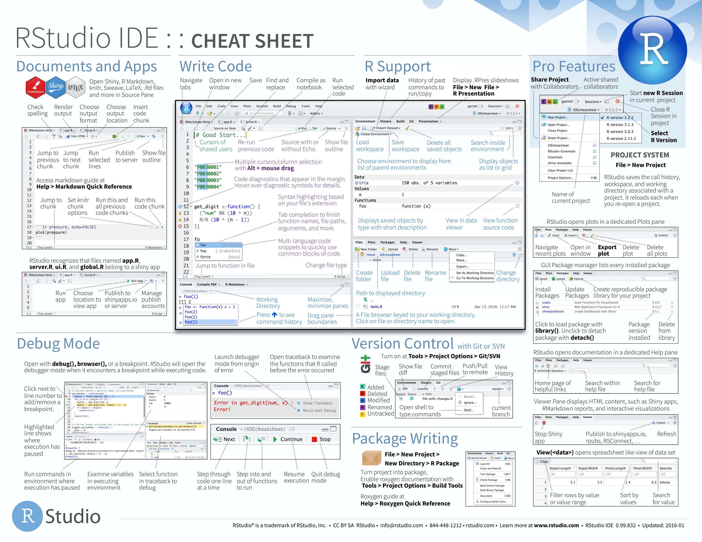

--- 
title: "Bookdown Thesis Template"
shorttitle: "Bookdown Thesis Template"

author:
# Contributorship roles (e.g., CRediT, https://casrai.org/credit/)
# You can format your author list in several ways; below are some examples:
- |
  First Last^[Corresponding author information],
  University,  
  Contributor Roles:  
  - Conceptualization  
  - Project Administration
- |
  First Last,
  University^[CRediT Contributor Roles]
- "First Last^[University, CRediT Contributor Roles]"

date: "`r format(Sys.Date(), '%B %d %Y')`"

site: bookdown::bookdown_site
output: bookdown::gitbook
documentclass: book
bibliography: ["references.bib", "r-packages.bib"]
biblio-style: "apa.csl"
link-citations: yes

github-repo: mccarthy-m-g/bookdown-thesis-template

favicon: www/favicon.ico
cover-image: 
description: "A bookdown thesis template for writing your thesis."
---
```{r include=FALSE, cache=FALSE}
set.seed(1014)
options(digits = 3)

###############################################################################
## setup
###############################################################################
knitr::opts_chunk$set(
  comment = "#>",
  collapse = TRUE,
  cache = TRUE,
  fig.retina = 0.8, # figures are either vectors or 300 dpi diagrams
  dpi = 300,
  out.width = "70%",
  fig.align = 'center',
  fig.width = 6,
  fig.asp = 0.618,  # 1 / phi
  fig.show = "hold",
  eval.after = 'fig.cap' # so captions can use link to demos
)

options(dplyr.print_min = 6,
        dplyr.print_max = 6,
        knitr.graphics.auto_pdf = TRUE)
```

```{r setup, include=FALSE}
renv::snapshot()
```

# Welcome {-}

This is the online version of *The Bookdown Thesis Template*.

The Bookdown Thesis Template is a comprehensive bookdown template, covering everything you need to write, edit, and disseminate your thesis. [bookdown](https://bookdown.org) is is an [open-source R package](https://github.com/rstudio/bookdown) that facilitates writing books and long-form articles or reports with R Markdown. Features include:

- Generate printer-ready books and ebooks from R Markdown documents.
- A markup language easier to learn than LaTeX, and to write elements such as section headers, lists, quotes, figures, tables, and citations.
- Multiple choices of output formats: PDF, LaTeX, HTML, EPUB, and Word.
- Possibility of including dynamic graphics and interactive applications (HTML widgets and Shiny apps).
- Support a wide range of languages: R, C/C++, Python, Fortran, Julia, Shell scripts, and SQL, etc.
- LaTeX equations, theorems, and proofs work for all output formats.
- Can be published to GitHub, bookdown.org, Netlify, and any web servers.
- Integrated with the RStudio IDE.

You can learn more about using bookdown to write your thesis in the short book [*bookdown: Authoring Books and Technical Documents with R Markdown*](https://bookdown.org/yihui/bookdown/).

If you do not wish to publish your thesis to its own website, the R package [papaja](https://crsh.github.io/papaja_man/customizations.html#writing-dissertations) might be better for you.

## License {-}

This template is licensed to you under the [MIT License](https://github.com/mccarthy-m-g/bookdown-thesis-template/blob/master/LICENSE).

<!--chapter:end:index.Rmd-->

```{r include=FALSE, cache=FALSE}
set.seed(1014)
options(digits = 3)

###############################################################################
## setup
###############################################################################
knitr::opts_chunk$set(
  comment = "#>",
  collapse = TRUE,
  cache = TRUE,
  fig.retina = 0.8, # figures are either vectors or 300 dpi diagrams
  dpi = 300,
  out.width = "70%",
  fig.align = 'center',
  fig.width = 6,
  fig.asp = 0.618,  # 1 / phi
  fig.show = "hold",
  eval.after = 'fig.cap' # so captions can use link to demos
)

options(dplyr.print_min = 6,
        dplyr.print_max = 6,
        knitr.graphics.auto_pdf = TRUE)
```
# Preface {#preface}

This template is written in [R Markdown](https://rmarkdown.rstudio.com) with [bookdown](https://bookdown.org). It is automatically built from [source](https://github.com/mccarthy-m-g/bookdown-thesis-template) and deployed online using [GitHub Actions](https://help.github.com/en/actions). The Bookdown Thesis Template is a collaborative effort and fixes and improvements can be contributed via pull request.

## How this template is organized

This template is organized into two main sections: The first being a guide on how to use this template for your own thesis, and the second being an example thesis section to give you an idea of how your thesis can look using this template. You can also check out the [source files](https://github.com/mccarthy-m-g/bookdown-thesis-template) for this template if you want to see the syntax for anything implemented here.

## Prerequisites

We have made a few assumptions about what you already know in order to get the most out of this template. You should be comfortable using computers, and it's helpful if you have some R programming experience already. If you've never programmed in R before, you might find [Hands on Programming with R](https://rstudio-education.github.io/hopr/) by Garrett Grolemund and [R for Data Science](https://r4ds.had.co.nz) by Garrett Grolemund and Hadley Wickham to be useful companions to this template.

There are four things you need to use this template: R, RStudio, an R package called **bookdown**, and a handful of other R packages. Packages are the fundamental units of reproducible R code. They include reusable functions, the documentation that describes how to use them, and sample data.

If you want to manage and store revisions of your thesis or publish it to the web, you will also need: A GitHub account and a Netlify account. GitHub is a Git repository hosting service that allows you to manage and store revisions of your project online, control who has access to your project, and collaborate with others. Netlify is a free web-hosting service that integrates with GitHub, allowing you to automatically (or manually) publish your thesis online as its own website.

### R 

To download R, go to CRAN, the **c**omprehensive **R** **a**rchive **n**etwork. CRAN is composed of a set of mirror servers distributed around the world and is used to distribute R and R packages. Don't try and pick a mirror that's close to you: instead use the cloud mirror, <https://cloud.r-project.org>, which automatically figures it out for you.

A new major version of R comes out once a year, and there are 2-3 minor releases each year. Because a thesis is a multi-year project, it is likely that new major and minor versions of R will be released in the midst of your thesis. Although it's a good idea to update regularly (and putting it off only makes it worse), upgrading can be a bit of a hassle, especially for major versions, which require you to reinstall all your packages, and which may require you to change portions of any code you have written.

If upgrading your R version in the midst of your thesis sounds like a nightmare, we recommend you use the [renv]() R package to lock the R version used in your thesis project, whilst allowing you to use newer R versions for other projects. If you find yourself switching R versions frequently and use macOS, you may also find the [RSwitch](https://rud.is/rswitch/) menubar utility useful.

### RStudio

RStudio is an integrated development environment, or IDE, for R programming. Download and install it from <http://www.rstudio.com/download>. RStudio is updated a couple of times a year. When a new version is available, RStudio will let you know. It's a good idea to upgrade regularly so you can take advantage of the latest and greatest features. For this template, make sure you have at least RStudio 1.0.0.

If you have not used RStudio before, the [RStudio IDE Cheatsheet](https://github.com/rstudio/cheatsheets/raw/master/rstudio-ide.pdf) provides a nice overview of the program:

```{r, echo=FALSE, out.width="100%"}

```

As well as keyboard shortcuts to help improve your productivity:

```{r, echo=FALSE, out.width="100%"}
knitr::include_graphics("images/rstudio-ide-2.png")
```

### bookdown

You'll also need to install some R packages. An R **package** is a collection of functions, data, and documentation that extends the capabilities of base R. Using packages is key to the successful use of R.

You can install bookdown with a single line of code:

```{r, eval = FALSE}
install.packages("bookdown")
```

On your own computer, type that line of code in the console, and then press enter to run it. R will download the package from CRAN and install it on to your computer. If you have problems installing, make sure that you are connected to the internet, and that <https://cloud.r-project.org/> isn't blocked by your firewall or proxy. 

### Other packages

There are a few other packages you need to install in order to use this template. First is the tinytex package, which is used when building the PDF version of your book:

```{r, eval = FALSE}
install.packages("tinytex")
tinytex::install_tinytex()
```

Second is the renv package, which is used to create a reproducible environment for your R project:

```{r, eval = FALSE}
install.packages("renv")
```

Third are a handful of packages that are used to generate the acknowledgments and colophon sections at the bottom of this page:

```{r, eval = FALSE}
install.packages(c("magrittr", "gh", "tibble", "purrr", "readr", "dplyr"))
```

### GitHub

[GitHub](https://github.com) is a Git repository hosting service that allows you to manage and store revisions of your project online, control who has access to your project, and collaborate with others. You will need to register an account in order to use GitHub.

### Netlify

[Netlify](https://netlify.com) is a free web-hosting service that integrates with GitHub, allowing you to automatically (or manually) publish your thesis online as its own website. You will need to register an account in order to use GitHub---you can register using your GitHub account. 

## Acknowledgments

A big thank you to everyone who has supported me on this journey.

```{r, echo=FALSE}
# code taken from: https://github.com/hadley/mastering-shiny/blob/master/introduction.Rmd
library(magrittr)
contribs_all_json <- gh::gh("/repos/:owner/:repo/contributors",
  owner = "mccarthy-m-g",
  repo = "bookdown-thesis-template",
  .limit = Inf
)
contribs_all <- tibble::tibble(
  login = contribs_all_json %>% purrr::map_chr("login"),
  n = contribs_all_json %>% purrr::map_int("contributions")
)
contribs_old <- readr::read_csv("contributors.csv", col_types = list())
contribs_new <- contribs_all %>% dplyr::anti_join(contribs_old, by = "login")
# Get info for new contributors
needed_json <- purrr::map(
  contribs_new$login, 
  ~ gh::gh("/users/:username", username = .x)
)
info_new <- tibble::tibble(
  login = contribs_new$login,
  name = purrr::map_chr(needed_json, "name", .default = NA),
  blog = purrr::map_chr(needed_json, "blog", .default = NA)
)
info_old <- contribs_old %>% dplyr::select(login, name, blog)
info_all <- dplyr::bind_rows(info_old, info_new)
contribs_all <- contribs_all %>% 
  dplyr::left_join(info_all, by = "login") %>% 
  dplyr::arrange(login)
readr::write_csv(contribs_all, "contributors.csv")
```

```{r, echo=FALSE, results = "asis", message = FALSE}
# code modified from: https://github.com/hadley/mastering-shiny/blob/master/introduction.Rmd
contributors <- read.csv("contributors.csv", stringsAsFactors = FALSE)
contributors <- contributors %>% 
  dplyr::filter(login != "mccarthy-m-g") %>% 
  dplyr::mutate(
    login = paste0("\\@", login),
    desc = ifelse(is.na(name), login, paste0(name, " (", login, ")"))
  )
if (nrow(contributors) != 0) {
  cat("This thesis was written in the open, and many people have contributed fixes and improvements. A big thank you to all ", nrow(contributors), " people who contributed via GitHub pull requests (in alphabetical order by username): ", sep = "")
  cat(paste0(contributors$desc, collapse = ", "))
  cat(".\n")
}
```

## Colophon

This template was written in [RStudio](http://www.rstudio.com/ide/) using [bookdown](http://bookdown.org/). The online version of this template is available at https://your-url. It is hosted with [netlify](http://netlify.com/), and is automatically updated after every commit by [GitHub Actions](https://help.github.com/en/actions). The complete source is available at https://github.com/mccarthy-m-g/bookdown-thesis-template.

This version of the template was built with `r R.version.string` and the following packages:

```{r, echo=FALSE, results="asis", warning=FALSE, message=FALSE}
# read renv.lock
renvLock <- jsonlite::read_json("renv.lock")
# write R packages from renv.lock to r-packages.bib
knitr::write_bib(names(renvLock$Packages), "r-packages.bib")
# get location of package versions and sources
pkg_version <- paste0("renvLock$Packages$", names(renvLock$Packages), "$Version")
pkg_source <- paste0("renvLock$Packages$", names(renvLock$Packages), "$Repository")

# create tibble of packages, their versions, and their source
df <- tibble::tibble(
  package = names(renvLock$Packages),
  version = sapply(pkg_version, function(x) eval(parse(text = x))),
  source = sapply(pkg_source, function(x) eval(parse(text = x)))
)
knitr::kable(df, format = "markdown")
```

```{r, echo=FALSE}
# code taken from: https://github.com/hadley/mastering-shiny/blob/master/introduction.Rmd
ruler <- function(width = getOption("width")) {
  x <- seq_len(width)
  y <- dplyr::case_when(
    x %% 10 == 0 ~ as.character((x %/% 10) %% 10),
    x %% 5 == 0  ~ "+",
    TRUE         ~ "-"
  )
  cat(y, "\n", sep = "")
  cat(x %% 10, "\n", sep = "")
}
```
```{r, echo=FALSE, include = FALSE}
ruler()
```

<!--chapter:end:preface.Rmd-->

```{r include=FALSE, cache=FALSE}
set.seed(1014)
options(digits = 3)

###############################################################################
## setup
###############################################################################
knitr::opts_chunk$set(
  comment = "#>",
  collapse = TRUE,
  cache = TRUE,
  fig.retina = 0.8, # figures are either vectors or 300 dpi diagrams
  dpi = 300,
  out.width = "70%",
  fig.align = 'center',
  fig.width = 6,
  fig.asp = 0.618,  # 1 / phi
  fig.show = "hold",
  eval.after = 'fig.cap' # so captions can use link to demos
)

options(dplyr.print_min = 6,
        dplyr.print_max = 6,
        knitr.graphics.auto_pdf = TRUE)
```
# (PART) Setup {-}

# Getting Started

We recommend reading the online version of this template rather than the source files while you are getting started.

## With Git (Recommended)

The best way to get started with with this template is through forking the `bookdown-thesis-template` on GitHub:

1. Install R, RStudio, bookdown, and the other R packages on your computer.

2. Create a GitHub account.

3. Set up Git on your computer using [RStudio](https://happygitwithr.com) (recommended) or [GitHub Desktop](https://desktop.github.com).

4. [Fork](https://docs.github.com/en/github/getting-started-with-github/fork-a-repo) the GitHub repository https://github.com/mccarthy-m-g/bookdown-thesis-template, then clone it to your computer using [RStudio](https://support.rstudio.com/hc/en-us/articles/200532077-Version-Control-with-Git-and-SVN) (recommended) or [GitHub Desktop](https://docs.github.com/en/desktop/contributing-and-collaborating-using-github-desktop/cloning-and-forking-repositories-from-github-desktop).

5. Open the `bookdown-thesis-template` repository you cloned in RStudio by double-clicking `bookdown-thesis-template.Rproj`.

6. Open the R Markdown file `index.Rmd` and click the button Build Book on the Build tab of RStudio to render the template.

## Without Git

The easiest way for beginners to get started with this template is through downloading the `bookdown-thesis-template` on GitHub:

1. Install R, RStudio, bookdown, and the other R packages on your computer.

2. Download the GitHub repository https://github.com/mccarthy-m-g/bookdown-thesis-template as a Zip file, then unzip it locally.

3. Open the `bookdown-thesis-template` repository you downloaded in RStudio by double-clicking `bookdown-thesis-template.Rproj`.

4. Open the R Markdown file `index.Rmd` and click the button Build Book on the Build tab of RStudio to render the template.

<!--chapter:end:getting-started.Rmd-->

```{r include=FALSE, cache=FALSE}
set.seed(1014)
options(digits = 3)

###############################################################################
## setup
###############################################################################
knitr::opts_chunk$set(
  comment = "#>",
  collapse = TRUE,
  cache = TRUE,
  fig.retina = 0.8, # figures are either vectors or 300 dpi diagrams
  dpi = 300,
  out.width = "70%",
  fig.align = 'center',
  fig.width = 6,
  fig.asp = 0.618,  # 1 / phi
  fig.show = "hold",
  eval.after = 'fig.cap' # so captions can use link to demos
)

options(dplyr.print_min = 6,
        dplyr.print_max = 6,
        knitr.graphics.auto_pdf = TRUE)
```
# Web Publishing

One of the easiest ways to share and get feedback on your thesis is by publishing it as its own website. bookdown---in tandem with GitHub and Netlify---makes this easy to do, even if you don't have prior experience with web publishing:

1. Complete Steps 1-6 in [Getting Started With Git][With Git (Recommended)].

2. Create a Netlify account, using your GitHub account to sign up.

3. Create a new Netlify site without connecting to Git by dragging an empty folder into the "Want to deploy a new site without connecting to Git? Drag and drop your site folder here" box.

4. Add your [Netlify API ID](https://docs.netlify.com/cli/get-started/#link-with-an-environment-variable) and a [Netlify Authorization Token](https://docs.netlify.com/cli/get-started/#obtain-a-token-in-the-netlify-ui) to your [GitHub Secrets](https://docs.github.com/en/actions/configuring-and-managing-workflows/creating-and-storing-encrypted-secrets) in your repository.

5. Modify the R version on line 16 of `.github/workflows/bookdown.yaml` to match the R version you plan to use for this project.

6. Either (a) use `renv::restore()` to re-install the exact packages declared in the project lockfile `renv.lock`^[You may also need to find and install the older version of R used previously with that project, unless your intention is to upgrade R.], or (b) use `renv::init()` to re-initialize the project with a brand new project library^[You may need to reinstall the bookdown and tinytex packages after re-initializing to ensure they are stored in the project's lockfile].

7. Commit and push any changes to your repository---this will trigger GitHub Actions to build your book and deploy it to Netlify.

8. Replace the GitHub Actions build status badge and Netlify deployment status badge in `README.md` with the badge URLs from your own GitHub repository and Netlify site.

<!--chapter:end:web-publishing.Rmd-->

```{r include=FALSE, cache=FALSE}
set.seed(1014)
options(digits = 3)

###############################################################################
## setup
###############################################################################
knitr::opts_chunk$set(
  comment = "#>",
  collapse = TRUE,
  cache = TRUE,
  fig.retina = 0.8, # figures are either vectors or 300 dpi diagrams
  dpi = 300,
  out.width = "70%",
  fig.align = 'center',
  fig.width = 6,
  fig.asp = 0.618,  # 1 / phi
  fig.show = "hold",
  eval.after = 'fig.cap' # so captions can use link to demos
)

options(dplyr.print_min = 6,
        dplyr.print_max = 6,
        knitr.graphics.auto_pdf = TRUE)
```
# Housekeeping

Now that your template is all set up, you can delete or modify some of the existing files in the template.

<!--chapter:end:housekeeping.Rmd-->

```{r include=FALSE, cache=FALSE}
set.seed(1014)
options(digits = 3)

###############################################################################
## setup
###############################################################################
knitr::opts_chunk$set(
  comment = "#>",
  collapse = TRUE,
  cache = TRUE,
  fig.retina = 0.8, # figures are either vectors or 300 dpi diagrams
  dpi = 300,
  out.width = "70%",
  fig.align = 'center',
  fig.width = 6,
  fig.asp = 0.618,  # 1 / phi
  fig.show = "hold",
  eval.after = 'fig.cap' # so captions can use link to demos
)

options(dplyr.print_min = 6,
        dplyr.print_max = 6,
        knitr.graphics.auto_pdf = TRUE)
```
# (PART) Using bookdown {-}

# Writing in bookdown

## Referencing

You can reference any of the packages included in your `renv.lock` file using the the following syntax `[@R-packagename]`.

<!--chapter:end:writing-in-bookdown.Rmd-->

```{r include=FALSE, cache=FALSE}
set.seed(1014)
options(digits = 3)

###############################################################################
## setup
###############################################################################
knitr::opts_chunk$set(
  comment = "#>",
  collapse = TRUE,
  cache = TRUE,
  fig.retina = 0.8, # figures are either vectors or 300 dpi diagrams
  dpi = 300,
  out.width = "70%",
  fig.align = 'center',
  fig.width = 6,
  fig.asp = 0.618,  # 1 / phi
  fig.show = "hold",
  eval.after = 'fig.cap' # so captions can use link to demos
)

options(dplyr.print_min = 6,
        dplyr.print_max = 6,
        knitr.graphics.auto_pdf = TRUE)
```
# Useful Functions and Packages

## Citation packages

### rbbt

### citr

## Plotting packages

### ggplot2

## Statistics packages

### effectsize


<!--chapter:end:useful-functions.Rmd-->

```{r include=FALSE, cache=FALSE}
set.seed(1014)
options(digits = 3)

###############################################################################
## setup
###############################################################################
knitr::opts_chunk$set(
  comment = "#>",
  collapse = TRUE,
  cache = TRUE,
  fig.retina = 0.8, # figures are either vectors or 300 dpi diagrams
  dpi = 300,
  out.width = "70%",
  fig.align = 'center',
  fig.width = 6,
  fig.asp = 0.618,  # 1 / phi
  fig.show = "hold",
  eval.after = 'fig.cap' # so captions can use link to demos
)

options(dplyr.print_min = 6,
        dplyr.print_max = 6,
        knitr.graphics.auto_pdf = TRUE)
```
# (PART) Example Chapters {-}

# Introduction

This section of the Bookdown Thesis Template includes a mock thesis that you can use as the skeleton for your thesis. It makes use of the papaja package [@R-papaja] to print important numbers and statistics using values from code---this means that if any numbers in the code change, so too will those numbers change in the body of the thesis.

For this thesis we will simulate data for a two group between-subjects experiment. Here is the code to simulate our data: 

```{r simulate-data}
# load package
library(dplyr)
# seed for random number generation
set.seed(43)
# create dataset
df_ind_t.test <- tibble::tibble(ID = 1:100,
                                Gender = c(rep("Male", 40),
                                           rep("Female", 60)
                                           ),
                                IV = c(rep("A", 50),
                                       rep("B", 50)
                                       ),
                                DV = c(round(rnorm(n = 50, mean = 150, sd = 20)),
                                       round(rnorm(n = 50, mean = 100, sd = 17))
                                       )
                                )
# encode IV as a factor
df_ind_t.test$IV <- factor(df_ind_t.test$IV, levels = c("A", "B"))
```

For this experiment we will test the hypothesis that participants in group A had significantly higher scores on the dependent variable than participants in group B.

<!--chapter:end:introduction.Rmd-->

```{r include=FALSE, cache=FALSE}
set.seed(1014)
options(digits = 3)

###############################################################################
## setup
###############################################################################
knitr::opts_chunk$set(
  comment = "#>",
  collapse = TRUE,
  cache = TRUE,
  fig.retina = 0.8, # figures are either vectors or 300 dpi diagrams
  dpi = 300,
  out.width = "70%",
  fig.align = 'center',
  fig.width = 6,
  fig.asp = 0.618,  # 1 / phi
  fig.show = "hold",
  eval.after = 'fig.cap' # so captions can use link to demos
)

options(dplyr.print_min = 6,
        dplyr.print_max = 6,
        knitr.graphics.auto_pdf = TRUE)
```
# Methodology

```{r participants, echo=FALSE}
participant_total <- nrow(df_ind_t.test)
males_total <- df_ind_t.test %>% filter(Gender == "Male") %>% nrow()
females_total <- df_ind_t.test %>% filter(Gender == "Female") %>% nrow()
participant_exclusion_total <- as.integer(0)
```

`r papaja::printnum(participant_total)` participants (`r papaja::printnum(males_total)` Males, `r papaja::printnum(females_total)` Females) from the community participated in exchange for $20. Data for `r papaja::printnum(participant_exclusion_total, numerals = FALSE)` of these participants were excluded due to meeting predetermined exclusion criteria. All participants were randomly assigned to a condition using a double-blind procedure.^[Note: All the numbers in this section, including the "zero" were printed using inline R code. The advantage of this is that, since the numbers are determined by code, if there are any changes to the code or data, any resulting changes to the numbers in the body of your thesis will be automatically updated. To see how this works, see the source file `methodology.Rmd`.]

<!--chapter:end:methodology.Rmd-->

```{r include=FALSE, cache=FALSE}
set.seed(1014)
options(digits = 3)

###############################################################################
## setup
###############################################################################
knitr::opts_chunk$set(
  comment = "#>",
  collapse = TRUE,
  cache = TRUE,
  fig.retina = 0.8, # figures are either vectors or 300 dpi diagrams
  dpi = 300,
  out.width = "70%",
  fig.align = 'center',
  fig.width = 6,
  fig.asp = 0.618,  # 1 / phi
  fig.show = "hold",
  eval.after = 'fig.cap' # so captions can use link to demos
)

options(dplyr.print_min = 6,
        dplyr.print_max = 6,
        knitr.graphics.auto_pdf = TRUE)
```
# Results

```{r descriptive-statistics, echo=FALSE}
# get descriptive statistics for each group -----------------------------------
descriptive_statistics_table <- df_ind_t.test %>%
  group_by(IV) %>%
  summarise(n = dplyr::n(),
            Mean = mean(DV),
            Variance = sd(DV)^2,
            SD = sd(DV),
            SE = sd(DV)/sqrt(dplyr::n()),
            CI.lower = mean(DV) - (abs(qnorm((1-0.95)/2)) * sd(DV)/sqrt(dplyr::n())),
            CI.upper = mean(DV) + (abs(qnorm((1-0.95)/2)) * sd(DV)/sqrt(dplyr::n()))
            )
descriptive_statistics <- purrr::transpose(dplyr::select(descriptive_statistics_table, !IV))
names(descriptive_statistics) <- descriptive_statistics_table$IV

# get summary statistics for the entire sample --------------------------------
summary_statistics_G <- df_ind_t.test %>%
  summarise(N = nrow(.),
            Grand.Mean = mean(DV),
            Grand.Variance = sd(DV)^2,
            Grand.SD = sd(DV),
            Grand.SE = sd(DV)/sqrt(nrow(.)),
            Grand.CI.lower = mean(DV) - (abs(qnorm((1-0.95)/2)) * sd(DV)/sqrt(nrow(.))),
            Grand.CI.upper = mean(DV) + (abs(qnorm((1-0.95)/2)) * sd(DV)/sqrt(nrow(.)))
            ) %>%
  as.list()
```

```{r run-ttest}
# run ttest
model <- t.test(DV ~ IV, data = df_ind_t.test)
# get effect size
model_effsize <- effectsize::cohens_d(DV ~ IV, data = df_ind_t.test)$Cohens_d
# set the significance level for the omnibus ANOVA
sig_level <- 0.05
# test significance
model_p.value <- broom::tidy(model)$p.value
model_significance <- model_p.value < sig_level

# PRINTING --------------------------------------------------------------------
# concatenate omnibus ANOVA and effect sizes into an APA string
print_model <- paste0(papaja::apa_print(model)$statistic, ", $d = ",
                      sprintf("%.2f", round(model_effsize, 2)), "$")
```

An independent t-test was used to test the hypothesis that participants in group A had significantly higher scores on the dependent variable than participants in group B. Results of the t-test show that the hypothesis was supported, with scores in group A ($M = `r papaja::printnum(descriptive_statistics$A$Mean)`$, $SD = `r papaja::printnum(descriptive_statistics$A$SD)`$) being significantly higher than scores in group B ($M = `r papaja::printnum(descriptive_statistics$B$Mean)`)$, $SD = `r papaja::printnum(descriptive_statistics$B$SD)`$), `r print_model`.

<!--chapter:end:results.Rmd-->

```{r include=FALSE, cache=FALSE}
set.seed(1014)
options(digits = 3)

###############################################################################
## setup
###############################################################################
knitr::opts_chunk$set(
  comment = "#>",
  collapse = TRUE,
  cache = TRUE,
  fig.retina = 0.8, # figures are either vectors or 300 dpi diagrams
  dpi = 300,
  out.width = "70%",
  fig.align = 'center',
  fig.width = 6,
  fig.asp = 0.618,  # 1 / phi
  fig.show = "hold",
  eval.after = 'fig.cap' # so captions can use link to demos
)

options(dplyr.print_min = 6,
        dplyr.print_max = 6,
        knitr.graphics.auto_pdf = TRUE)
```
# Discussion

As demonstrated in the results, participants in group A had significantly higher scores on the dependent variable than participants in group B, indicating something profound that will change the minds of readers everywhere. However, we should note one limitation of this study: It's absolutely vague and we actually don't know what it was about!

<!--chapter:end:discussion.Rmd-->

```{r include=FALSE, cache=FALSE}
set.seed(1014)
options(digits = 3)

###############################################################################
## setup
###############################################################################
knitr::opts_chunk$set(
  comment = "#>",
  collapse = TRUE,
  cache = TRUE,
  fig.retina = 0.8, # figures are either vectors or 300 dpi diagrams
  dpi = 300,
  out.width = "70%",
  fig.align = 'center',
  fig.width = 6,
  fig.asp = 0.618,  # 1 / phi
  fig.show = "hold",
  eval.after = 'fig.cap' # so captions can use link to demos
)

options(dplyr.print_min = 6,
        dplyr.print_max = 6,
        knitr.graphics.auto_pdf = TRUE)
```
# (PART) Appendix {-}

# References


<!--chapter:end:references.Rmd-->

