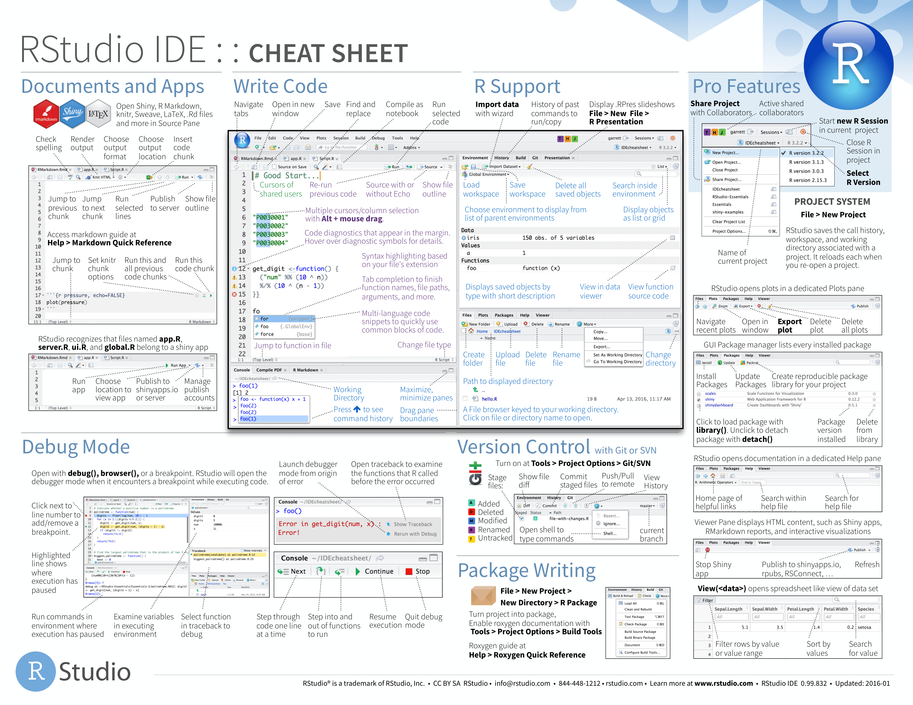
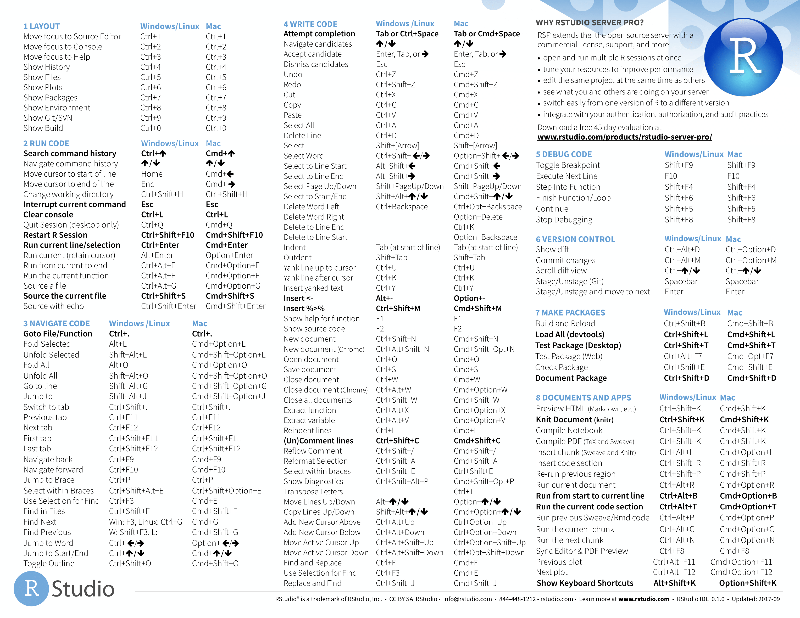

# Preface {#preface}

This template is written in [R Markdown](https://rmarkdown.rstudio.com) with [bookdown](https://bookdown.org). It is automatically built from [source](https://github.com/mccarthy-m-g/musicians-compendium) and deployed online using [GitHub Actions](https://help.github.com/en/actions). The Bookdown Thesis Template is a collaborative effort and fixes and improvements can be contributed via pull request.

## How this template is organized

gjhgf


## Prerequisites

We have made a few assumptions about what you already know in order to get the most out of this template. You should be comfortable using computers, and it's helpful if you have some R programming experience already. If you've never programmed in R before, you might find [Hands on Programming with R](https://rstudio-education.github.io/hopr/) by Garrett Grolemund and [R for Data Science](https://r4ds.had.co.nz) by Garrett Grolemund and Hadley Wickham to be useful companions to this template.

There are four things you need to use this template: R, RStudio, an R package called **bookdown**, and a handful of other R packages. Packages are the fundamental units of reproducible R code. They include reusable functions, the documentation that describes how to use them, and sample data.

If you want to manage and store revisions of your thesis or publish it to the web, you will also need: A GitHub account, and a Netlify account. GitHub is a Git repository hosting service that allows you to manage and store revisions of your project online, control who has access to your project, and collaborate with others. Netlify is a free web-hosting service that integrates with GitHub, allowing you to automatically (or manually) publish your thesis online as its own website.

### R 

To download R, go to CRAN, the **c**omprehensive **R** **a**rchive **n**etwork. CRAN is composed of a set of mirror servers distributed around the world and is used to distribute R and R packages. Don't try and pick a mirror that's close to you: instead use the cloud mirror, <https://cloud.r-project.org>, which automatically figures it out for you.

A new major version of R comes out once a year, and there are 2-3 minor releases each year. Because a thesis is a multi-year project, it is likely that new major and minor versions of R will be released in the midst of your thesis. Although it's a good idea to update regularly (and putting it off only makes it worse), upgrading can be a bit of a hassle, especially for major versions, which require you to reinstall all your packages, and which may require you to change portions of any code you have written.

If upgrading your R version in the midst of your thesis sounds like a nightmare, we recommend you use the [renv]() R package to lock the R version used in your thesis project, whilst allowing you to use newer R versions for other projects. If you find yourself switching R versions frequently and use macOS, you may also find the [RSwitch](https://rud.is/rswitch/) menubar utility useful.

### RStudio

RStudio is an integrated development environment, or IDE, for R programming. Download and install it from <http://www.rstudio.com/download>. RStudio is updated a couple of times a year. When a new version is available, RStudio will let you know. It's a good idea to upgrade regularly so you can take advantage of the latest and greatest features. For this template, make sure you have at least RStudio 1.0.0.

If you have not used RStudio before, the [RStudio IDE Cheatsheet](https://github.com/rstudio/cheatsheets/raw/master/rstudio-ide.pdf) provides a nice overview of the program:

```{r out.width="100%"}

```

As well as keyboard shortcuts to help improve your productivity:

```{r out.width="100%"}

```

### bookdown

You'll also need to install some R packages. An R **package** is a collection of functions, data, and documentation that extends the capabilities of base R. Using packages is key to the successful use of R.

You can install bookdown with a single line of code:

```{r, eval = FALSE}
install.packages("bookdown")
```

On your own computer, type that line of code in the console, and then press enter to run it. R will download the package from CRAN and install it on to your computer. If you have problems installing, make sure that you are connected to the internet, and that <https://cloud.r-project.org/> isn't blocked by your firewall or proxy. 

### Other packages

There are many other excellent packages that are not part of the tidyverse, because they solve problems in a different domain, or are designed with a different set of underlying principles. This doesn't make them better or worse, just different. In other words, the complement to the tidyverse is not the messyverse, but many other universes of interrelated packages. As you tackle more data science projects with R, you'll learn new packages and new ways of thinking about data. 

In this book we'll use three data packages from outside the tidyverse:

```{r, eval = FALSE}
install.packages(c("nycflights13", "gapminder", "Lahman"))
```

These packages provide data on airline flights, world development, and baseball that we'll use to illustrate key data science ideas.


should have some experience using [R](https://www.r-project.org), the [RStudio IDE](https://rstudio.com), and . If you do not have experience with any of these, 

### GitHub

[GitHub](https://github.com) is...

### Netlify

## Acknowledgments

```{r, eval = FALSE}
# code taken from: https://github.com/hadley/mastering-shiny/blob/master/introduction.Rmd
library(tidyverse)
contribs_all_json <- gh::gh("/repos/:owner/:repo/contributors",
  owner = "mccarthy-m-g",
  repo = "musicians-compendium",
  .limit = Inf
)
contribs_all <- tibble(
  login = contribs_all_json %>% map_chr("login"),
  n = contribs_all_json %>% map_int("contributions")
)
contribs_old <- read_csv("contributors.csv", col_types = list())
contribs_new <- contribs_all %>% anti_join(contribs_old, by = "login")
# Get info for new contributors
needed_json <- map(
  contribs_new$login, 
  ~ gh::gh("/users/:username", username = .x)
)
info_new <- tibble(
  login = contribs_new$login,
  name = map_chr(needed_json, "name", .default = NA),
  blog = map_chr(needed_json, "blog", .default = NA)
)
info_old <- contribs_old %>% select(login, name, blog)
info_all <- bind_rows(info_old, info_new)
contribs_all <- contribs_all %>% 
  left_join(info_all, by = "login") %>% 
  arrange(login)
write_csv(contribs_all, "contributors.csv")
```

```{r, results = "asis", message = FALSE}
# code taken from: https://github.com/hadley/mastering-shiny/blob/master/introduction.Rmd
library(dplyr)
contributors <- read.csv("contributors.csv", stringsAsFactors = FALSE)
contributors <- contributors %>% 
  filter(login != "mccarthy-m-g") %>% 
  mutate(
    login = paste0("\\@", login),
    desc = ifelse(is.na(name), login, paste0(name, " (", login, ")"))
  )
cat("This book was written in the open, and many people have contributed fixes and improvements. A big thank you to all ", nrow(contributors), " people who contributed via GitHub pull requests (in alphabetical order by username): ", sep = "")
cat(paste0(contributors$desc, collapse = ", "))
cat(".\n")
```

## Colophon

This template was written in [RStudio](http://www.rstudio.com/ide/) using [bookdown](http://bookdown.org/). The online version of this template is available at https://your-url. It is hosted with [netlify](http://netlify.com/), and is automatically updated after every commit by [GitHub Actions](https://help.github.com/en/actions). The complete source is available at https://github.com/mccarthy-m-g/bookdown-thesis-template.

This version of the template was built with `r R.version.string` and the following packages:

```{r, results="asis"}
# read renv.lock
renvLock <- jsonlite::read_json("renv.lock")
# write R packages from renv.lock to r-packages.bib
knitr::write_bib(names(renvLock$Packages), "r-packages.bib")
# get location of package versions and sources
pkg_version <- paste0("renvLock$Packages$", names(renvLock$Packages), "$Version")
pkg_source <- paste0("renvLock$Packages$", names(renvLock$Packages), "$Repository")

# create tibble of packages, their versions, and their source
df <- tibble::tibble(
  package = names(renvLock$Packages),
  version = sapply(pkg_version, function(x) eval(parse(text = x))),
  source = sapply(pkg_source, function(x) eval(parse(text = x)))
)
knitr::kable(df, format = "markdown")
```

```{r,}
# code taken from: https://github.com/hadley/mastering-shiny/blob/master/introduction.Rmd
ruler <- function(width = getOption("width")) {
  x <- seq_len(width)
  y <- dplyr::case_when(
    x %% 10 == 0 ~ as.character((x %/% 10) %% 10),
    x %% 5 == 0  ~ "+",
    TRUE         ~ "-"
  )
  cat(y, "\n", sep = "")
  cat(x %% 10, "\n", sep = "")
}
```
```{r, include = FALSE}
ruler()
```
